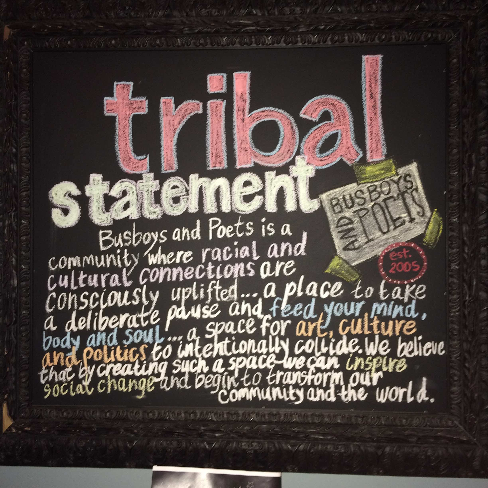

#Meld Function
We are a DC based local tech coopeartive focused on social change through a variety of lenses a strong drive for diversity
#Contact Us
* brandon@ideahound.org

#Join Us
* www.meetup.com/MeldFunction/

#Goals: 
* Unity in diversity and living ubuntu
* Empowering communities
* Driving sustainable change

#Why Coops
Model View Culture - https://modelviewculture.com/pieces/can-coops-revolutionize-the-tech-industry

#Inspring Organizations

* ONEDC - http://www.onedconline.org/
* Bus Boys and Poets

* Gratipay - https://gratipay.com/
* Loomio - https://www.loomio.org/marketing
* SELC - http://www.theselc.org/
* May First - https://mayfirst.org/en/index.html
* Tent - https://tent.io/about
* CoLab - https://colab.coop/
* Agile Coop - http://agile.coop/
* Igalia - http://www.igalia.com
* Much Different - http://www.muchdifferent.com/
* Radical Designs - http://radicaldesigns.org

#Challenges: 
Finding individuals, organizations and communities that are willing to join with us to colloborate on change near and far so drop us a line in you are so inclined

#Upcoming Events: May/TBD/2016

