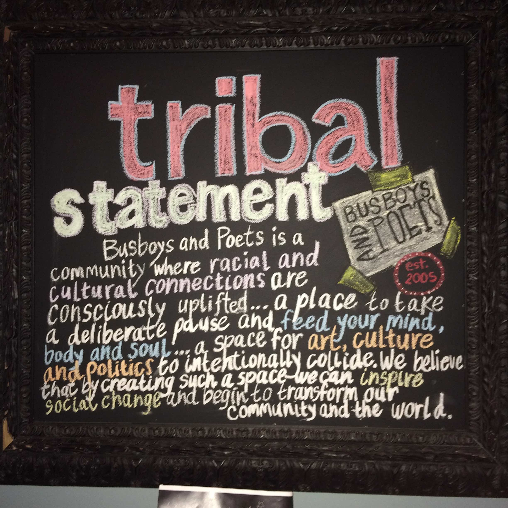

#Meld Function
We are a DC based local tech coopeartive focused on social change through a variety of lenses a strong drive for diversity
#Contact Us
* brandon@ideahound.org

#Join Us
* www.meetup.com/MeldFunction/

#What are Cooperatives?
http://www.co-oplaw.org/co-op-basics/what-are-cooperatives/
TL;DR?
" A cooperative is a business owned and controlled by the people who use its services. Unlike a typical business, which returns profits to the owners based on how much the owners have invested in the business, a cooperative rewards its owners based on how much they use the cooperative. And unlike a business where owners have different amounts of power based on how much money they have invested, a cooperative is governed on a democratic basis, with one vote per person regardless of investment.

Worker cooperatives are businesses owned and controlled by the people who work in them. The worker-members own the business and return its profits to themselves based on how much they work for the co-op. They control the co-op, perhaps by electing a Board of Directors to make policy and hire managers to organize their work, or (as is more common in smaller worker co-ops like ours) by governing and/or managing the co-op all together, as a collective." (http://techworker.coop/about)

#Goals: 
* Unity in diversity and living ubuntu
* Empowering communities
* Driving sustainable change

#Why Coops
* Model View Culture - https://modelviewculture.com/pieces/can-coops-revolutionize-the-tech-industry
* Is There Such Thing as a Digital Co-op? - http://cdi.coop/2016/03/10/is-there-such-thing-as-a-digital-co-op/

#Further Research
* The Next System Project http://thenextsystem.org/
* Where to Invade Next (https://youtu.be/1KeAZho8TKo)
* This Changes Everything (https://youtu.be/YQhflH4alO0)
* Populations Speak out (https://goo.gl/2iT8Lk)

#Legal Resources:
* http://communityenterpriselaw.org/
* http://www.co-oplaw.org/

#Inspring Organizations
* Democarcy Collaborative - http://democracycollaborative.org/
* Community Wealth - http://community-wealth.org/
* ONEDC - http://www.onedconline.org/
* Bus Boys and Poets

* Platform Cooperativism http://platformcoop.net/
* Palante Tech - http://palantetech.coop/
* Gratipay - https://gratipay.com/
* Loomio - https://www.loomio.org/marketing
* SELC - http://www.theselc.org/
* May First - https://mayfirst.org/en/index.html
* Tent - https://tent.io/about
* CoLab - https://colab.coop/
* Agile Coop - http://agile.coop/
* Igalia - http://www.igalia.com
* Much Different - http://www.muchdifferent.com/
* Radical Designs - http://radicaldesigns.org

#Current Challenges: 
Finding individuals, organizations and communities that are willing to join and colloborate for sustainable change so drop us a line in you feel so inclined

#Upcoming Events: May/TBD/2016

